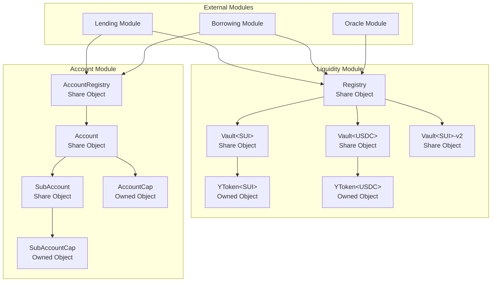
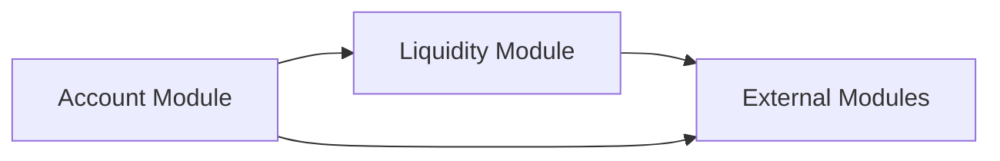
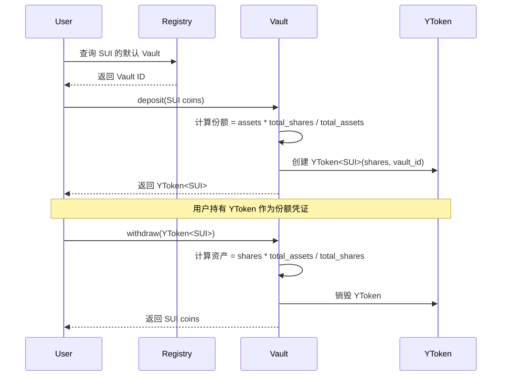
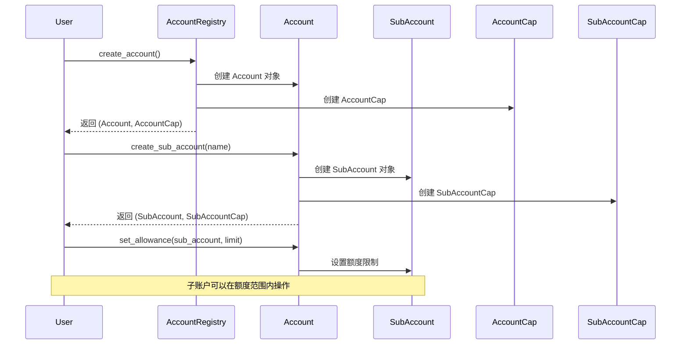

# Olend DeFi 借贷平台设计文档

## 概述

本设计文档基于需求1（统一流动性管理系统）和需求2（账户管理系统）的详细需求，设计了 Olend DeFi 借贷平台的核心架构。该设计采用模块化架构，确保系统的可扩展性、安全性和高效性。

核心设计原则：
- **统一流动性管理**：通过 Registry 和多 Vault 架构实现高效的资产管理
- **分层账户体系**：支持主账户和子账户的完整权限管理
- **模块化设计**：各模块职责清晰，接口标准化
- **安全优先**：多层安全机制确保资产和数据安全

## 架构

### 整体架构图



### 模块依赖关系



## 组件和接口

### 1. Liquidity Module 组件设计

#### 1.1 Registry 结构设计

```move
/// 全局资产金库注册表
public struct Registry has key {
    id: UID,
    version: u64,
    /// 资产类型到 Vault 列表的映射
    asset_vaults: Table<TypeName, VaultList>,
    /// 管理员权限
    admin_cap: ID,
}

/// 单个资产的 Vault 列表管理
public struct VaultList has store {
    /// 活跃的 Vault 列表
    active_vaults: vector<ID>,
    /// 默认 Vault（用于新存款）
    default_vault: Option<ID>,
    /// 暂停的 Vault 列表
    paused_vaults: vector<ID>,
}
```

**核心接口：**
```move
// 创建新的 Vault
public fun create_vault<T>(
    registry: &mut Registry,
    admin_cap: &AdminCap,
    ctx: &mut TxContext
): ID

// 获取资产的默认活跃 Vault
public fun get_default_vault<T>(registry: &Registry): Option<ID>

// 获取资产的所有活跃 Vault
public fun get_active_vaults<T>(registry: &Registry): vector<ID>

// 暂停 Vault
public fun pause_vault<T>(
    registry: &mut Registry,
    vault_id: ID,
    admin_cap: &AdminCap
)

// 设置默认 Vault
public fun set_default_vault<T>(
    registry: &mut Registry,
    vault_id: ID,
    admin_cap: &AdminCap
)
```

#### 1.2 Vault<T> 结构设计

```move
/// 统一流动性金库，兼容 ERC-4626 标准
public struct Vault<phantom T> has key {
    id: UID,
    version: u64,
    /// 金库中的总资产
    total_assets: Balance<T>,
    /// 已发行的总份额
    total_shares: u64,
    /// 借出的资产（由其他模块管理）
    borrowed_assets: u64,
    /// 金库状态
    status: VaultStatus,
    /// 每日提取限额配置
    daily_limit: DailyLimit,
    /// 金库配置参数
    config: VaultConfig,
}

/// 金库状态枚举
public struct VaultStatus has store, copy, drop {
    is_active: bool,
    is_paused: bool,
    allow_deposits: bool,
    allow_withdrawals: bool,
}

/// 每日限额管理
public struct DailyLimit has store {
    max_daily_withdrawal: u64,
    current_day: u64,
    withdrawn_today: u64,
}

/// 份额凭证
public struct YToken<phantom T> has key, store {
    id: UID,
    /// 份额数量
    shares: u64,
    /// 对应的 Vault ID
    vault_id: ID,
}
```

**核心接口（ERC-4626 兼容）：**
```move
// 存入资产，获得份额
public fun deposit<T>(
    vault: &mut Vault<T>,
    assets: Coin<T>,
    ctx: &mut TxContext
): YToken<T>

// 提取资产，销毁份额
public fun withdraw<T>(
    vault: &mut Vault<T>,
    ytoken: YToken<T>,
    ctx: &mut TxContext
): Coin<T>

// Package 级别的借出接口
public(package) fun borrow<T>(
    vault: &mut Vault<T>,
    amount: u64,
    ctx: &mut TxContext
): Coin<T>

// Package 级别的还款接口
public(package) fun repay<T>(
    vault: &mut Vault<T>,
    repayment: Coin<T>
)

// 查询函数
public fun total_assets<T>(vault: &Vault<T>): u64
public fun total_supply<T>(vault: &Vault<T>): u64
public fun convert_to_shares<T>(vault: &Vault<T>, assets: u64): u64
public fun convert_to_assets<T>(vault: &Vault<T>, shares: u64): u64
```

### 2. Account Module 组件设计

#### 2.1 AccountRegistry 结构设计

```move
/// 全局账户注册表
public struct AccountRegistry has key {
    id: UID,
    version: u64,
    /// 账户ID到Account对象ID的映射
    accounts: Table<address, ID>,
    /// 账户计数器
    account_counter: u64,
    /// 管理员权限
    admin_cap: ID,
}
```

**核心接口：**
```move
// 创建新账户
public fun create_account(
    registry: &mut AccountRegistry,
    user: address,
    ctx: &mut TxContext
): (Account, AccountCap)

// 查找账户
public fun get_account(registry: &AccountRegistry, user: address): Option<ID>

// 验证账户存在性
public fun account_exists(registry: &AccountRegistry, user: address): bool
```

#### 2.2 Account 结构设计

```move
/// 用户主账户
public struct Account has key {
    id: UID,
    version: u64,
    /// 账户所有者
    owner: address,
    /// 用户等级
    level: u8,
    /// 用户积分
    points: u64,
    /// 头寸ID列表（不存储详情）
    position_ids: vector<ID>,
    /// 子账户列表
    sub_accounts: vector<ID>,
    /// 账户状态
    status: AccountStatus,
}

/// 账户状态
public struct AccountStatus has store, copy, drop {
    is_active: bool,
    is_suspended: bool,
    created_at: u64,
    last_activity: u64,
}

/// 账户权限凭证（不可转让）
public struct AccountCap has key {
    id: UID,
    /// 对应的账户ID
    account_id: ID,
    /// 账户所有者
    owner: address,
}
```

**核心接口：**
```move
// 添加头寸ID
public fun add_position(
    account: &mut Account,
    cap: &AccountCap,
    position_id: ID
)

// 移除头寸ID
public fun remove_position(
    account: &mut Account,
    cap: &AccountCap,
    position_id: ID
)

// 更新用户等级和积分
public fun update_level_and_points(
    account: &mut Account,
    cap: &AccountCap,
    new_level: u8,
    points_delta: u64
)

// 查询函数
public fun get_position_ids(account: &Account): vector<ID>
public fun get_level(account: &Account): u8
public fun get_points(account: &Account): u64
```

#### 2.3 SubAccount 结构设计

```move
/// 子账户
public struct SubAccount has key {
    id: UID,
    /// 父账户ID
    parent_account_id: ID,
    /// 子账户名称/标识
    name: String,
    /// 头寸ID列表
    position_ids: vector<ID>,
    /// 授权额度
    allowances: Table<TypeName, Allowance>,
    /// 子账户状态
    status: AccountStatus,
}

/// 额度授权结构
public struct Allowance has store {
    /// 总授权额度
    total_limit: u64,
    /// 已使用额度
    used_amount: u64,
    /// 额度类型（借贷、交易等）
    allowance_type: u8,
    /// 过期时间（可选）
    expires_at: Option<u64>,
}

/// 子账户权限凭证
public struct SubAccountCap has key {
    id: UID,
    /// 对应的子账户ID
    sub_account_id: ID,
    /// 父账户ID
    parent_account_id: ID,
}
```

**核心接口：**
```move
// 创建子账户
public fun create_sub_account(
    account: &mut Account,
    cap: &AccountCap,
    name: String,
    ctx: &mut TxContext
): (SubAccount, SubAccountCap)

// 设置子账户额度
public fun set_allowance<T>(
    account: &Account,
    sub_account: &mut SubAccount,
    cap: &AccountCap,
    limit: u64,
    allowance_type: u8
)

// 检查和扣减额度
public fun check_and_consume_allowance<T>(
    sub_account: &mut SubAccount,
    cap: &SubAccountCap,
    amount: u64,
    allowance_type: u8
): bool

// 查询剩余额度
public fun get_remaining_allowance<T>(
    sub_account: &SubAccount,
    allowance_type: u8
): u64
```

## 数据模型

### 1. 流动性管理数据流



### 2. 账户管理数据流



## 错误处理

### 1. Liquidity Module 错误类型

```move
/// 流动性模块错误码
const E_VAULT_PAUSED: u64 = 1001;
const E_VAULT_NOT_FOUND: u64 = 1002;
const E_INSUFFICIENT_ASSETS: u64 = 1003;
const E_DAILY_LIMIT_EXCEEDED: u64 = 1004;
const E_INVALID_SHARES: u64 = 1005;
const E_VERSION_MISMATCH: u64 = 1006;
const E_UNAUTHORIZED_ACCESS: u64 = 1007;
const E_VAULT_NOT_ACTIVE: u64 = 1008;
```

### 2. Account Module 错误类型

```move
/// 账户模块错误码
const E_ACCOUNT_NOT_FOUND: u64 = 2001;
const E_ACCOUNT_SUSPENDED: u64 = 2002;
const E_INSUFFICIENT_ALLOWANCE: u64 = 2003;
const E_UNAUTHORIZED_OPERATION: u64 = 2004;
const E_INVALID_SUB_ACCOUNT: u64 = 2005;
const E_ALLOWANCE_EXPIRED: u64 = 2006;
const E_ACCOUNT_CAP_MISMATCH: u64 = 2007;
```

### 3. 错误处理策略

1. **输入验证**：所有公共函数都进行严格的输入验证
2. **状态检查**：操作前检查对象状态（是否暂停、是否活跃等）
3. **权限验证**：确保调用者具有相应的权限
4. **原子性保证**：关键操作使用事务确保原子性
5. **优雅降级**：在非关键错误情况下提供备选方案

## 测试策略

### 1. 单元测试覆盖

#### Liquidity Module 测试用例
- **Registry 管理测试**
  - 创建和查找 Vault
  - 多 Vault 管理
  - Vault 状态切换
  - 版本控制

- **Vault 操作测试**
  - 存取资产正常流程
  - 份额计算准确性
  - 每日限额控制
  - 暂停功能
  - ERC-4626 兼容性

#### Account Module 测试用例
- **账户管理测试**
  - 账户创建和查找
  - 头寸ID管理
  - 等级积分更新

- **子账户测试**
  - 子账户创建
  - 额度设置和检查
  - 权限层级验证

### 2. 集成测试场景

1. **跨模块交互测试**
   - 账户系统与流动性系统的集成
   - 权限验证流程
   - 数据一致性验证

2. **边界条件测试**
   - 极限额度测试
   - 并发操作测试
   - 异常恢复测试

3. **安全测试**
   - 权限绕过尝试
   - 重入攻击防护
   - 数据篡改防护

### 3. 性能测试

1. **吞吐量测试**：测试高并发下的系统性能
2. **延迟测试**：测试关键操作的响应时间
3. **资源消耗测试**：测试 gas 消耗和存储效率

## 安全考虑

### 1. 权限控制

- **分层权限**：主账户 > 子账户的权限层级
- **最小权限原则**：每个组件只获得必要的权限
- **权限验证**：所有敏感操作都需要权限验证

### 2. 数据安全

- **数据隔离**：不同用户和不同 Vault 的数据完全隔离
- **状态一致性**：确保系统状态的一致性和完整性
- **版本控制**：通过版本字段防止旧版本的恶意调用

### 3. 经济安全

- **汇率操纵防护**：防止通过大额操作操纵份额汇率
- **闪电贷防护**：防止闪电贷攻击
- **额度控制**：通过每日限额和子账户额度控制风险

### 4. 运营安全

- **紧急暂停**：关键组件都支持紧急暂停功能
- **管理员权限**：管理员权限的安全管理和多签控制
- **升级机制**：安全的合约升级机