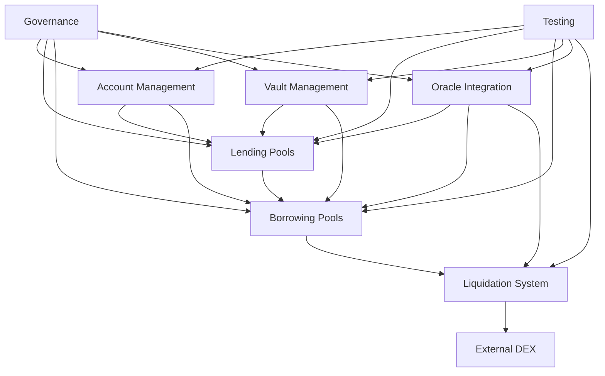
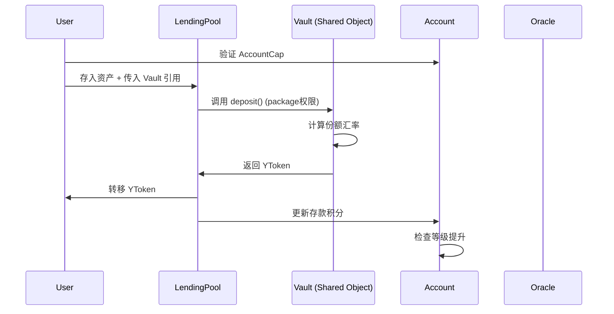
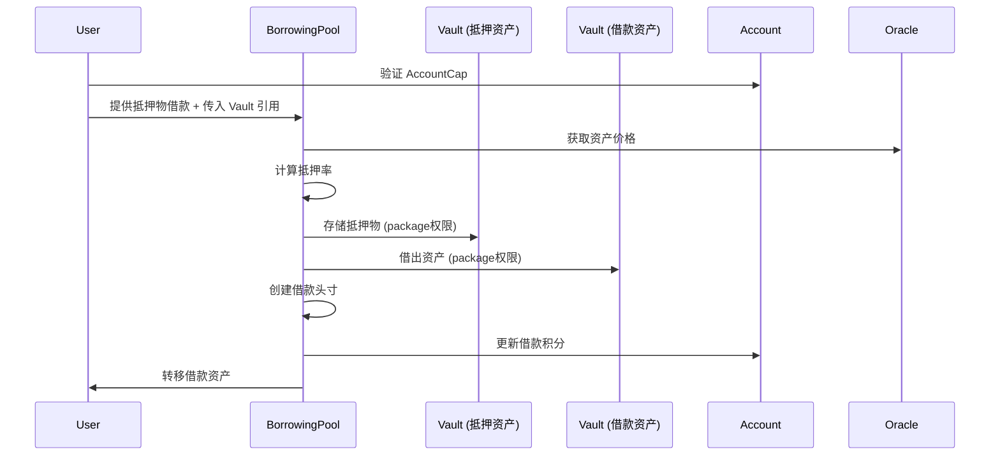
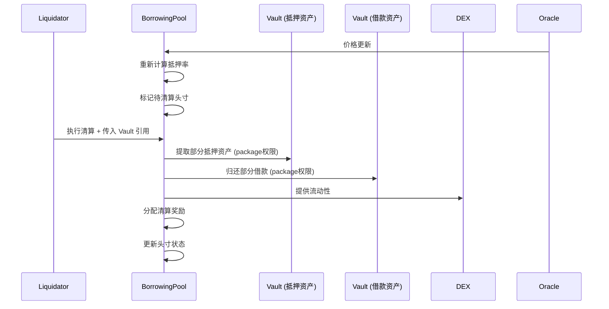

# Olend DeFi 借贷平台设计文档

## 概述

Olend 是一个基于 Sui Network 的去中心化借贷平台，采用 Sui Move 智能合约语言开发。本设计文档基于需求文档，详细描述了系统的技术架构、组件设计、数据模型和实现方案。

### 核心设计原则

1. **统一流动性**：每种资产类型只有一个 Vault，最大化资本效率
2. **高抵押率**：通过 Tick 清算机制实现高达97%的借贷价值比
3. **低清算罚金**：实现低至0.1%的清算罚金保护用户利益
4. **模块化设计**：各模块职责清晰，便于维护和升级
5. **安全优先**：多层安全机制和风险控制
6. **用户激励**：完整的积分和等级系统

## 系统架构

### 整体架构图

```
┌─────────────────────────────────────────────────────────────────┐
│                        Olend DeFi Platform                      │
├─────────────────────────────────────────────────────────────────┤
│  Frontend Layer                                                 │
│  ┌─────────────┐  ┌─────────────┐  ┌─────────────┐             │
│  │   Web App   │  │ Mobile App  │  │   Admin     │             │
│  └─────────────┘  └─────────────┘  └─────────────┘             │
├─────────────────────────────────────────────────────────────────┤
│  API Layer                                                      │
│  ┌─────────────────────────────────────────────────────────────┐ │
│  │              GraphQL / REST API                             │ │
│  └─────────────────────────────────────────────────────────────┘ │
├─────────────────────────────────────────────────────────────────┤
│  Smart Contract Layer (Sui Move)                               │
│  ┌─────────────┐  ┌─────────────┐  ┌─────────────┐             │
│  │   Account   │  │   Vault     │  │   Oracle    │             │
│  │  Management │  │  Management │  │ Integration │             │
│  └─────────────┘  └─────────────┘  └─────────────┘             │
│  ┌─────────────┐  ┌─────────────┐  ┌─────────────┐             │
│  │   Lending   │  │  Borrowing  │  │ Liquidation │             │
│  │    Pools    │  │    Pools    │  │   System    │             │
│  └─────────────┘  └─────────────┘  └─────────────┘             │
│  ┌─────────────┐  ┌─────────────┐                               │
│  │ Governance  │  │   Testing   │                               │
│  │   System    │  │   Quality   │                               │
│  └─────────────┘  └─────────────┘                               │
├─────────────────────────────────────────────────────────────────┤
│  External Integration Layer                                     │
│  ┌─────────────┐  ┌─────────────┐  ┌─────────────┐             │
│  │    Pyth     │  │    Cetus    │  │   Bluefin   │             │
│  │   Oracle    │  │     DEX     │  │     DEX     │             │
│  └─────────────┘  └─────────────┘  └─────────────┘             │
│  ┌─────────────┐                                                │
│  │  DEEPBook   │                                                │
│  │     DEX     │                                                │
│  └─────────────┘                                                │
├─────────────────────────────────────────────────────────────────┤
│  Sui Network Infrastructure                                     │
│  ┌─────────────────────────────────────────────────────────────┐ │
│  │                 Sui Blockchain                              │ │
│  └─────────────────────────────────────────────────────────────┘ │
└─────────────────────────────────────────────────────────────────┘
```

### 模块依赖关系



## 核心组件设计

### 1. 统一流动性管理系统

#### 架构说明

**Vault<T> 作为 Shared Object**：
- 每种资产类型有且仅有一个 Vault<T> 作为 Shared Object
- 所有真实资产都存储在对应的 Vault<T> 中
- Vault<T> 的资产操作方法都是 `public(package)` 权限，只能被平台内其他模块调用
- 用户不能直接调用 Vault<T> 的方法，必须通过 LendingPool 或 BorrowingPool

**Registry 的作用**：
- 用于管理和查询 Vault 的地址和状态
- 不存储 Vault 对象本身，只记录地址映射
- 提供 Vault 的活跃状态管理

**资金流转模式**：
- 用户操作时将 Vault 作为参数传入到 Pool 函数中
- Pool 通过 `public(package)` 方法调用 Vault 进行资产操作
- Pool 只记录业务逻辑数据，不直接持有资产

### 1. 统一流动性管理系统

#### Registry 设计

```move
/// 全局资产金库注册表 - 用于管理和查询
public struct Registry has key {
    id: UID,
    version: u64,
    /// 资产类型到 Vault 地址的映射（用于查询和验证）
    vault_addresses: Table<TypeName, address>,
    /// 活跃状态映射
    active_vaults: Table<TypeName, bool>,
    /// 管理员权限
    admin_cap: ID,
}

/// 金库管理权限凭证
public struct RegistryAdminCap has key, store {
    id: UID,
}
```

#### Vault<T> 设计

```move
/// 统一流动性金库 - Shared Object
public struct Vault<phantom T> has key {
    id: UID,
    version: u64,
    /// 底层资产余额
    balance: Balance<T>,
    /// 总份额供应量
    total_shares: u64,
    /// 是否活跃
    is_active: bool,
    /// 每日提取限额
    daily_withdraw_limit: u64,
    /// 当日已提取金额
    daily_withdrawn: u64,
    /// 重置时间戳
    last_reset_timestamp: u64,
    /// 借出资产记录
    borrowed_amount: u64,
}

/// 份额凭证代币
public struct YToken<phantom T> has key, store {
    id: UID,
    /// 份额数量
    shares: u64,
}

/// Vault 核心方法（仅 package 内可调用）
/// 存入资产并铸造份额
public(package) fun deposit<T>(
    vault: &mut Vault<T>, 
    asset: Coin<T>
): YToken<T> { /* 实现 */ }

/// 提取资产并销毁份额
public(package) fun withdraw<T>(
    vault: &mut Vault<T>, 
    ytoken: YToken<T>
): Coin<T> { /* 实现 */ }

/// 借出资产（仅借款池调用）
public(package) fun borrow<T>(
    vault: &mut Vault<T>, 
    amount: u64
): Coin<T> { /* 实现 */ }

/// 归还资产（仅借款池调用）
public(package) fun repay<T>(
    vault: &mut Vault<T>, 
    asset: Coin<T>
) { /* 实现 */ }
```

### 2. 账户管理系统

#### AccountRegistry 设计

```move
/// 全局账户注册表
public struct AccountRegistry has key {
    id: UID,
    version: u64,
    /// 账户ID到Account的映射
    accounts: Table<ID, ID>,
    /// 用户地址到账户ID的映射
    user_accounts: Table<address, ID>,
    /// 下一个账户ID
    next_account_id: u64,
}

/// 用户账户
public struct Account has key {
    id: UID,
    version: u64,
    /// 账户ID
    account_id: u64,
    /// 用户地址
    owner: address,
    /// 用户等级
    level: u8,
    /// 总积分
    total_points: u64,
    /// 存款积分
    deposit_points: u64,
    /// 借款积分
    borrow_points: u64,
    /// 信用积分
    credit_points: u64,
    /// 头寸ID列表
    position_ids: vector<ID>,
    /// 创建时间
    created_at: u64,
    /// 最后活跃时间
    last_active: u64,
}

/// 账户权限凭证
public struct AccountCap has key {
    id: UID,
    /// 对应的账户ID
    account_id: u64,
}
```

### 3. 预言机集成系统

#### PriceOracle 设计

```move
/// 价格预言机
public struct PriceOracle has key {
    id: UID,
    version: u64,
    /// Pyth price feed ID 映射
    price_feeds: Table<TypeName, vector<u8>>,
    /// 价格缓存
    price_cache: Table<TypeName, PriceInfo>,
    /// 最大价格延迟时间（秒）
    max_price_delay: u64,
    /// 最小置信度要求
    min_confidence: u64,
}

/// 价格信息
public struct PriceInfo has store {
    /// 价格（8位小数精度）
    price: u64,
    /// 置信区间
    confidence: u64,
    /// 发布时间戳
    timestamp: u64,
    /// 指数
    expo: i32,
}
```

### 4. 借贷池管理系统

#### LendingPoolRegistry 设计

```move
/// 借贷池注册表
public struct LendingPoolRegistry has key {
    id: UID,
    version: u64,
    /// 池ID到池对象的映射
    pools: Table<ID, ID>,
    /// 资产类型到池ID列表的映射
    asset_pools: Table<TypeName, vector<ID>>,
    /// 下一个池ID
    next_pool_id: u64,
}

/// 借贷池 - 只记录业务逻辑，不持有资产
public struct LendingPool<phantom T> has key {
    id: UID,
    version: u64,
    /// 池ID
    pool_id: u64,
    /// 池名称
    name: String,
    /// 利率模型类型
    interest_model: u8, // 0: 动态, 1: 固定
    /// 基础利率
    base_rate: u64,
    /// 利率斜率
    rate_slope: u64,
    /// 固定利率（仅固定利率模型使用）
    fixed_rate: u64,
    /// 记录的总存款量（用于统计和利率计算）
    total_deposits: u64,
    /// 记录的总借出量（用于统计和利率计算）
    total_borrowed: u64,
    /// 流动性预留比例
    reserve_ratio: u64,
    /// 平台费用比例
    platform_fee_rate: u64,
    /// 最大单笔存款限额
    max_deposit_limit: u64,
    /// 每日提取限额
    daily_withdraw_limit: u64,
    /// 是否暂停
    is_paused: bool,
}

/// LendingPool 核心方法示例
/// 用户存款（需要传入 Vault 引用）
public fun deposit<T>(
    pool: &mut LendingPool<T>,
    vault: &mut Vault<T>,  // Vault 作为参数传入
    account_cap: &AccountCap,
    asset: Coin<T>,
    ctx: &mut TxContext
): YToken<T> {
    // 1. 验证用户权限
    // 2. 调用 vault::deposit() (package权限)
    // 3. 更新 pool 的统计数据
    // 4. 更新用户积分
    // 5. 返回 YToken
}
```

### 5. 借款池管理系统

#### BorrowingPoolRegistry 设计

```move
/// 借款池注册表
public struct BorrowingPoolRegistry has key {
    id: UID,
    version: u64,
    /// 池ID到池对象的映射
    pools: Table<ID, ID>,
    /// 资产类型到池ID列表的映射
    asset_pools: Table<TypeName, vector<ID>>,
    /// 下一个池ID
    next_pool_id: u64,
}

/// 借款池 - 只记录业务逻辑，不持有资产
public struct BorrowingPool<phantom T> has key {
    id: UID,
    version: u64,
    /// 池ID
    pool_id: u64,
    /// 池名称
    name: String,
    /// 利率模型类型
    interest_model: u8,
    /// 基础利率
    base_rate: u64,
    /// 利率斜率
    rate_slope: u64,
    /// 风险溢价
    risk_premium: u64,
    /// 初始抵押率阈值
    initial_ltv: u64,
    /// 警告抵押率阈值
    warning_ltv: u64,
    /// 清算抵押率阈值
    liquidation_ltv: u64,
    /// 记录的总借款量（用于统计和利率计算）
    total_borrowed: u64,
    /// 活跃头寸数量
    active_positions: u64,
    /// Tick 清算配置
    tick_size: u64,
    /// 清算罚金比例
    liquidation_penalty: u64,
    /// 最大单笔借款限额
    max_borrow_limit: u64,
    /// 是否暂停
    is_paused: bool,
}

/// BorrowingPool 核心方法示例
/// 用户借款（需要传入多个 Vault 引用）
public fun borrow<T, C>(
    pool: &mut BorrowingPool<T>,
    borrow_vault: &mut Vault<T>,      // 借款资产的 Vault
    collateral_vault: &mut Vault<C>,  // 抵押资产的 Vault
    account_cap: &AccountCap,
    collateral: YToken<C>,            // 抵押的 YToken
    borrow_amount: u64,
    oracle: &PriceOracle,
    ctx: &mut TxContext
): (Coin<T>, BorrowPosition) {
    // 1. 验证用户权限
    // 2. 通过预言机获取价格
    // 3. 计算抵押率
    // 4. 调用 borrow_vault::borrow() (package权限)
    // 5. 存储抵押物到 collateral_vault
    // 6. 创建借款头寸
    // 7. 更新用户积分
    // 8. 返回借款资产和头寸
}

/// 借款头寸
public struct BorrowPosition has key, store {
    id: UID,
    /// 头寸ID
    position_id: ID,
    /// 借款人账户ID
    borrower_account: u64,
    /// 借款池ID
    pool_id: u64,
    /// 抵押物类型和数量
    collaterals: Table<TypeName, u64>,
    /// 借款金额
    borrowed_amount: u64,
    /// 累积利息
    accrued_interest: u64,
    /// 创建时间
    created_at: u64,
    /// 最后更新时间
    last_updated: u64,
    /// 借款期限类型
    term_type: u8, // 0: 不定期, 1: 定期
    /// 到期时间（仅定期借款）
    maturity_time: Option<u64>,
    /// 头寸状态
    status: u8, // 0: 活跃, 1: 待清算, 2: 已清算, 3: 已关闭
}
```

### 6. 高效清算系统

清算系统集成在 BorrowingPool 中，不是独立的全局系统：

```move
/// Tick 清算配置
public struct TickLiquidationConfig has store {
    /// Tick 大小（抵押率区间）
    tick_size: u64,
    /// 每次清算比例
    liquidation_ratio: u64,
    /// 最大清算比例
    max_liquidation_ratio: u64,
    /// 清算罚金比例
    penalty_rate: u64,
    /// 清算奖励比例
    reward_rate: u64,
}

/// DEX 集成配置
public struct DEXConfig has store {
    /// 支持的 DEX 列表
    supported_dexes: vector<String>,
    /// DEX 优先级
    dex_priorities: Table<String, u8>,
    /// 最小流动性要求
    min_liquidity: Table<String, u64>,
}
```

### 7. 治理和收益分配系统

```move
/// 治理系统
public struct Governance has key {
    id: UID,
    version: u64,
    /// 开发团队多签地址
    dev_team_multisig: address,
    /// 保险基金地址
    insurance_fund: address,
    /// 国库地址
    treasury: address,
    /// 收益分配比例
    revenue_distribution: RevenueDistribution,
    /// 多签阈值
    multisig_threshold: u8,
    /// 多签成员
    multisig_members: vector<address>,
}

/// 收益分配配置
public struct RevenueDistribution has store {
    /// 开发团队比例 (10%)
    dev_team_rate: u64,
    /// 保险基金比例 (10%)
    insurance_rate: u64,
    /// 国库比例 (10%)
    treasury_rate: u64,
    /// 用户收益比例 (70%)
    user_rate: u64,
}
```

## 数据流设计

### 存款流程



### 借款流程



### 清算流程



## 安全设计

### 权限控制

1. **多签控制**：关键操作需要多签验证
2. **版本控制**：通过 version 字段控制访问权限
3. **角色分离**：不同角色有不同的权限范围
4. **时间锁**：重要参数变更有延迟生效机制

### 风险管理

1. **价格验证**：多重价格数据验证机制
2. **限额控制**：设置各种操作限额
3. **紧急暂停**：支持紧急情况下的系统暂停
4. **保险基金**：设立保险基金应对极端情况

### 数据完整性

1. **原子操作**：确保关键操作的原子性
2. **状态一致性**：维护系统状态的一致性
3. **错误处理**：完善的错误处理和恢复机制
4. **审计日志**：记录所有重要操作的详细日志

## 性能优化

### 存储优化

1. **表结构设计**：使用高效的 Table 数据结构
2. **数据分片**：按资产类型和池ID进行数据分片
3. **缓存机制**：缓存频繁访问的数据
4. **历史数据管理**：合理管理历史数据存储

### 计算优化

1. **批量操作**：支持批量处理提高效率
2. **算法优化**：使用高效的数学计算算法
3. **并行处理**：支持并行处理多个操作
4. **预计算**：预计算常用的数值

### 网络优化

1. **事件优化**：优化事件发射和监听
2. **查询优化**：优化数据查询接口
3. **批量查询**：支持批量数据查询
4. **数据压缩**：压缩传输数据

## 升级策略

### 合约升级

1. **版本控制**：使用版本号控制合约升级
2. **向后兼容**：保持向后兼容性
3. **数据迁移**：提供数据迁移机制
4. **测试验证**：充分的测试和验证

### 参数升级

1. **治理投票**：通过治理机制调整参数
2. **延迟生效**：参数变更延迟生效
3. **影响评估**：评估参数变更的影响
4. **回滚机制**：支持参数回滚

## 监控和运维

### 系统监控

1. **健康检查**：实时监控系统健康状况
2. **性能监控**：监控系统性能指标
3. **错误监控**：监控和报告系统错误
4. **资源监控**：监控资源使用情况

### 运维工具

1. **管理界面**：提供系统管理界面
2. **数据分析**：提供数据分析工具
3. **报告生成**：自动生成运营报告
4. **告警系统**：异常情况告警机制

## 测试策略

### 单元测试

1. **函数测试**：测试每个公共函数
2. **边界测试**：测试边界条件和异常情况
3. **状态测试**：测试状态变更的正确性
4. **权限测试**：测试权限控制的有效性

### 集成测试

1. **模块集成**：测试模块间的交互
2. **端到端测试**：测试完整的业务流程
3. **性能测试**：测试系统性能和负载能力
4. **安全测试**：测试系统安全性

### 部署测试

1. **测试网部署**：在测试网充分测试
2. **压力测试**：进行压力和负载测试
3. **兼容性测试**：测试与外部系统的兼容性
4. **回归测试**：确保新功能不影响现有功能

## 部署计划

### 阶段一：核心功能
- 统一流动性管理系统
- 账户管理系统
- 预言机集成系统

### 阶段二：借贷功能
- 借贷池管理系统
- 借款池管理系统
- 基础清算功能

### 阶段三：高级功能
- 高效清算系统
- 用户积分和等级系统
- DEX 集成

### 阶段四：治理和优化
- 治理系统
- 性能优化
- 监控和运维工具

## 风险评估

### 技术风险

1. **智能合约漏洞**：通过代码审计和测试降低风险
2. **预言机风险**：使用多个价格源和验证机制
3. **清算风险**：设计robust的清算机制
4. **升级风险**：谨慎的升级策略和测试

### 市场风险

1. **价格波动**：通过合理的抵押率和清算机制管理
2. **流动性风险**：通过多DEX集成和流动性管理
3. **利率风险**：通过动态利率模型调整
4. **系统性风险**：通过保险基金和风险控制

### 运营风险

1. **治理风险**：通过多签和治理机制控制
2. **合规风险**：遵循相关法律法规
3. **声誉风险**：通过透明运营和用户保护
4. **技术风险**：通过持续的技术维护和升级

## 总结

本设计文档详细描述了 Olend DeFi 借贷平台的技术架构和实现方案。通过模块化设计、统一流动性管理、高效清算机制和完善的用户激励系统，平台将为用户提供安全、高效、用户友好的 DeFi 借贷服务。

设计的核心特点包括：
- 统一流动性管理提高资本效率
- 高达97%的借贷价值比
- 低至0.1%的清算罚金
- 完整的用户积分和等级系统
- 简化但安全的治理机制
- 70%的收益返还给用户

通过分阶段的部署计划和全面的测试策略，确保平台的稳定性和安全性，为成为支持10亿美元以上资金规模的大型 DeFi 平台奠定坚实基础。