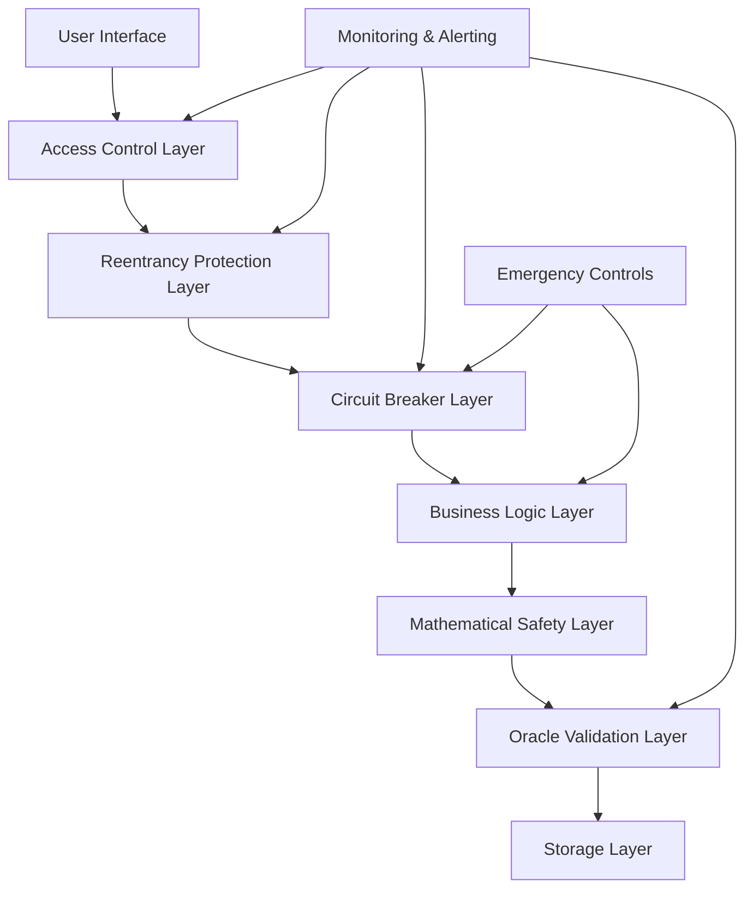

# Security Hardening Design Document

## Overview

This design document outlines the comprehensive security hardening approach for the OLend DeFi lending platform. The design addresses critical vulnerabilities including oracle manipulation, integer overflow, access control gaps, reentrancy attacks, and flash loan exploits. The solution implements defense-in-depth principles with multiple layers of protection.

## Architecture

### Security Layer Architecture



### Core Security Components

1. **Oracle Security Module** - Enhanced price validation and manipulation detection
2. **Mathematical Safety Module** - Overflow-protected arithmetic operations
3. **Access Control Module** - Role-based permissions with time delays
4. **Reentrancy Guard Module** - State-based protection against recursive calls
5. **Circuit Breaker Module** - Automatic protection during extreme conditions
6. **Flash Loan Protection Module** - Time-based restrictions and pattern detection
7. **Monitoring Module** - Comprehensive event logging and alerting

## Components and Interfaces

### 1. Oracle Security Module

#### Enhanced PriceOracle Structure
```move
public struct SecurePriceOracle has key {
    id: UID,
    version: u64,
    admin_cap_id: ID,
    
    // Enhanced validation parameters
    price_feeds: Table<TypeName, PriceFeedConfig>,
    price_cache: Table<TypeName, ValidatedPriceInfo>,
    
    // Security configurations
    max_price_delay: u64,           // Maximum acceptable staleness
    min_confidence: u64,            // Minimum confidence threshold
    max_price_deviation: u64,       // Maximum price change per block
    circuit_breaker_threshold: u64, // Extreme movement threshold
    
    // Price history for validation
    price_history: Table<TypeName, vector<PricePoint>>,
    
    // Emergency controls
    emergency_mode: bool,
    emergency_admin_cap_id: ID,
}

public struct PriceFeedConfig has store {
    feed_id: vector<u8>,
    decimals: u8,
    heartbeat: u64,                // Expected update frequency
    deviation_threshold: u64,      // Acceptable price deviation
    confidence_threshold: u64,     // Minimum confidence requirement
}

public struct ValidatedPriceInfo has store, copy, drop {
    price: u64,
    confidence: u64,
    timestamp: u64,
    expo: u8,
    is_valid: bool,
    
    // Enhanced validation fields
    validation_score: u64,         // Composite validation score
    last_validation_time: u64,    // Last successful validation
}
```

#### Oracle Validation Functions
```move
// Enhanced price validation with multiple checks
public fun validate_price_comprehensive(
    oracle: &SecurePriceOracle,
    asset_type: TypeName,
    clock: &Clock
): ValidatedPriceInfo

// Price manipulation detection
public fun detect_price_manipulation(
    oracle: &mut SecurePriceOracle,
    asset_type: TypeName,
    current_price: u64,
    timestamp: u64
): bool

// Circuit breaker activation
public fun check_and_activate_circuit_breaker(
    oracle: &mut SecurePriceOracle,
    asset_type: TypeName,
    price_change_percentage: u64
): bool
```

### 2. Mathematical Safety Module

#### SafeMath Library
```move
public struct SafeMath has drop {}

// Overflow-protected multiplication
public fun safe_mul_div(
    a: u64,
    b: u64,
    c: u64
): u64

// Overflow-protected addition
public fun safe_add(a: u64, b: u64): u64

// Underflow-protected subtraction
public fun safe_sub(a: u64, b: u64): u64

// Safe percentage calculations
public fun safe_percentage(
    amount: u64,
    percentage: u64,
    basis_points: u64
): u64

// Collateral ratio calculation with overflow protection
public fun calculate_collateral_ratio_safe(
    collateral_value: u64,
    borrowed_value: u64,
    precision: u64
): u64
```

### 3. Circuit Breaker Module

#### Circuit Breaker Structure
```move
public struct CircuitBreakerRegistry has key {
    id: UID,
    version: u64,
    
    // Circuit breaker states per operation type
    breakers: Table<vector<u8>, CircuitBreakerState>,
    
    // Global emergency controls
    global_emergency: bool,
    emergency_triggered_time: u64,
    
    // Thresholds and configurations
    operation_thresholds: Table<vector<u8>, ThresholdConfig>,
    
    // Recovery mechanisms
    recovery_conditions: Table<vector<u8>, RecoveryConfig>,
}

public struct CircuitBreakerState has store {
    is_open: bool,
    failure_count: u64,
    last_failure_time: u64,
    last_success_time: u64,
    state_change_time: u64,
}

public struct ThresholdConfig has store {
    failure_threshold: u64,
    time_window: u64,
    recovery_timeout: u64,
    volume_threshold: u64,
}
```

### 6. Flash Loan Protection Module

#### Flash Loan Protection Structure
```move
public struct FlashLoanProtection has key {
    id: UID,
    version: u64,
    
    // Position aging requirements
    position_age_requirements: Table<vector<u8>, u64>,
    position_creation_times: Table<ID, u64>,
    
    // Rate limiting
    operation_counts: Table<address, OperationCounter>,
    rate_limits: Table<vector<u8>, RateLimit>,
    
    // Pattern detection
    suspicious_patterns: Table<address, SuspiciousActivity>,
    
    // Cooldown periods
    cooldown_periods: Table<address, u64>,
}

public struct OperationCounter has store {
    count: u64,
    window_start: u64,
    last_operation: u64,
}

public struct SuspiciousActivity has store {
    activity_count: u64,
    first_activity_time: u64,
    last_activity_time: u64,
    activity_types: vector<u8>,
}
```

## Data Models

### Enhanced Error Handling

#### Security-Specific Error Codes (Sui Move Applicable)
```move
// Security error codes (5000-5999)
const E_ORACLE_PRICE_STALE: u64 = 5001;
const E_ORACLE_CONFIDENCE_LOW: u64 = 5002;
const E_PRICE_MANIPULATION_DETECTED: u64 = 5003;
const E_CIRCUIT_BREAKER_ACTIVE: u64 = 5004;
const E_MATH_OVERFLOW: u64 = 5007;
const E_MATH_UNDERFLOW: u64 = 5008;
const E_OPERATION_BLOCKED: u64 = 5015;
const E_GLOBAL_EMERGENCY_ACTIVE: u64 = 5016;
```

### Security Event Structures
```move
public struct SecurityEvent has copy, drop {
    event_type: vector<u8>,
    severity: u8,
    timestamp: u64,
    affected_address: address,
    details: vector<u8>,
    mitigation_action: vector<u8>,
}

public struct OracleSecurityEvent has copy, drop {
    asset_type: TypeName,
    event_type: vector<u8>,
    price_before: u64,
    price_after: u64,
    confidence: u64,
    deviation_percentage: u64,
    timestamp: u64,
}
```

## Error Handling

### Comprehensive Error Management Strategy

1. **Fail-Safe Defaults**: All security checks default to the most restrictive state
2. **Graceful Degradation**: System continues operating with reduced functionality during emergencies
3. **Detailed Logging**: All security events are logged with comprehensive context
4. **Automatic Recovery**: Self-healing mechanisms where possible
5. **Manual Override**: Emergency admin controls for critical situations

### Error Recovery Mechanisms

```move
// Automatic recovery for circuit breakers
public fun attempt_circuit_breaker_recovery(
    registry: &mut CircuitBreakerRegistry,
    operation_type: vector<u8>,
    clock: &Clock
): bool

// Emergency recovery procedures
public fun emergency_recovery_procedure(
    access_control: &mut AccessControlRegistry,
    circuit_breakers: &mut CircuitBreakerRegistry,
    oracle: &mut SecurePriceOracle,
    emergency_admin: address
)
```

## Testing Strategy

### Security Testing Framework

1. **Unit Testing**
   - Individual security component testing
   - Edge case validation
   - Error condition testing

2. **Integration Testing**
   - Cross-component security interactions
   - End-to-end security flow testing
   - Emergency scenario testing

3. **Fuzz Testing**
   - Mathematical operation fuzzing
   - Input validation fuzzing
   - State transition fuzzing

4. **Attack Simulation**
   - Oracle manipulation simulation
   - Flash loan attack simulation
   - Reentrancy attack simulation
   - MEV attack simulation

5. **Stress Testing**
   - High-volume operation testing
   - Extreme market condition simulation
   - System limit testing

### Test Categories

#### Oracle Security Tests
```move
#[test]
fun test_oracle_price_staleness_detection()

#[test]
fun test_oracle_confidence_validation()

#[test]
fun test_price_manipulation_detection()

#[test]
fun test_price_history_tracking()

#[test]
fun test_circuit_breaker_activation()
```

#### Mathematical Safety Tests
```move
#[test]
fun test_safe_math_overflow_protection()

#[test]
fun test_collateral_ratio_calculation_safety()

#[test]
fun test_interest_calculation_precision()

#[test]
fun fuzz_test_mathematical_operations()
```

#### Access Control Tests
```move
#[test]
fun test_role_based_access_control()

#[test]
fun test_time_delayed_operations()

#[test]
fun test_multisig_requirements()

#[test]
fun test_emergency_pause_functionality()
```

#### Reentrancy Protection Tests
```move
#[test]
fun test_reentrancy_guard_effectiveness()

#[test]
fun test_cross_contract_reentrancy_protection()

#[test]
fun test_state_consistency_during_calls()
```

#### Flash Loan Protection Tests
```move
#[test]
fun test_position_aging_requirements()

#[test]
fun test_rate_limiting_effectiveness()

#[test]
fun test_suspicious_pattern_detection()

#[test]
fun test_flash_loan_attack_prevention()
```

### Continuous Security Monitoring

1. **Real-time Monitoring**
   - Price deviation monitoring
   - Transaction pattern analysis
   - System health monitoring

2. **Alerting System**
   - Immediate alerts for critical events
   - Escalation procedures
   - Automated response triggers

3. **Audit Trail**
   - Comprehensive event logging
   - Immutable audit records
   - Forensic analysis capabilities

This design provides a comprehensive security hardening framework that addresses all identified vulnerabilities while maintaining system performance and usability. The modular approach allows for incremental implementation and testing of each security component.